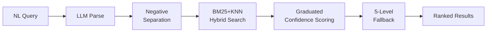
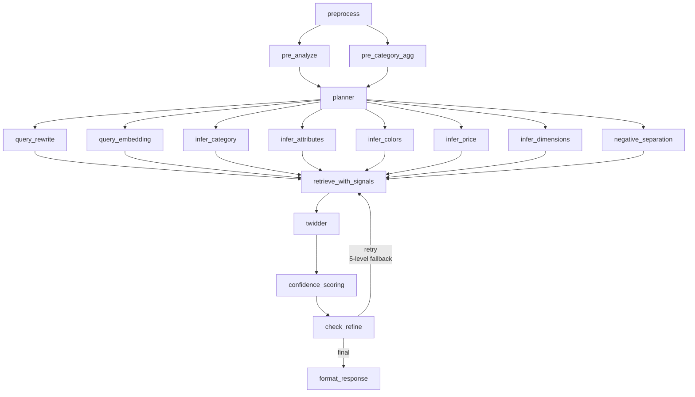

## Overview

At Bucketplace (오늘의집), I am building an AI-powered search agent that interprets natural language queries and translates them into structured retrieval signals for Room Planner 3D products. The system decomposes free-form user intent into actionable dimensions -- category, attributes, color, dimensions, and budget -- via LLM reasoning, then executes BM25+KNN hybrid search on ElasticSearch to surface the most relevant 3D product models.

At the core of this project is **CoI-Fit (Context-Intent Fit Matching)**, a compositional multimodal retrieval framework I designed to serve as the retrieval backbone for multiple downstream agents. CoI-Fit combines space analysis, mood/style interpretation, dimensional constraints, and conversational context drawn from image, text, and 3D coordinate inputs to produce contextually grounded retrieval results.

## Key Achievements

- **Compositional Retrieval Framework**: Designed CoI-Fit, a novel multimodal retrieval architecture that fuses heterogeneous signals (visual, textual, spatial) into a unified retrieval pipeline
- **Two-Tier Negative Query Separation**: Hard exclude (must-not) + soft downrank via graduated confidence scoring, preventing irrelevant results while preserving recall
- **5-Level Progressive Fallback**: Graceful degradation from full-signal retrieval down to broad category search, ensuring non-empty results even for ambiguous queries
- **Multi-Agent Architecture**: Architected a LangGraph pipeline with parallel fan-out inference, enabling concurrent processing of multiple retrieval dimensions
- **Dual Interface Design**: Built both A2A (Agent-to-Agent) JSON-RPC and REST/FastAPI interfaces, enabling seamless integration with both agent ecosystems and traditional service architectures
- **Auto Quality Recovery**: Implemented intelligent filter relaxation retry mechanisms that automatically recover from overly restrictive queries, ensuring high recall even for long-tail searches
- **Automated Quality Evaluation**: 8-dimension rule-based CI scoring + LLM-as-Judge with LangFuse experiment tracking; persona-based synthetic query generation for long-tail coverage

### Benchmark Results (634 queries)

| Metric | Improvement |
|---|---|
| Judge Satisfaction | **+11.9%** |
| Category Recall | **+16.6%** |
| Positive Hit | **+18.0%** |
| Negative Leak | **-50%** |
| Latency p50 | **-20.8%** |

## Technical Approach

### Pipeline Topology

The system follows a multi-stage agentic pipeline with parallel fan-out for inference:

### Request Journey (End-to-End)

1. **Intake**: Input normalization, safety check, format validation
2. **Analyze & Plan**: Language/token analysis, category aggregation, search mode determination
3. **Parallel Intelligence**: Fan-out to 8 concurrent inference nodes — query rewrite, embedding generation, category/attribute/color/price/dimension signal extraction, and negative query separation (hard exclude vs. soft downrank)
4. **Retrieval & Ranking**: BM25 + KNN hybrid search with two-tier negative filtering and twidder for product_id deduplication
5. **Confidence Scoring**: Graduated scoring across retrieval signals to rank results by match quality
6. **Quality Recovery**: 5-level progressive fallback (full-signal → relaxed filters → broad category) with max 1 refine to protect p99
7. **Response**: Final items with optional debug metadata (node latency, signals, ES query)

### CoI-Fit: Compositional Multimodal Retrieval

CoI-Fit (Context-Intent Fit Matching) serves as the retrieval backbone for multiple downstream agents:

- **Space Analysis**: Understanding room context and spatial arrangement from 3D coordinates
- **Mood/Style Matching**: Extracting aesthetic intent from text and image inputs
- **Dimensional Constraints**: Filtering by physical size requirements derived from the 3D scene
- **Conversational Context**: Maintaining coherent retrieval across multi-turn interactions

### State Design (3-Layer)

| Layer | Role | Properties |
|---|---|---|
| `inputs` | Request original | Immutable |
| `artifacts` | Intermediate outputs | Mutable, parallel accumulation |
| `outputs` | Final response | Finalized at exit |

### Architecture Integration

The system operates as both a standalone service and a domain agent within the AI-AP (AI Agent Platform) orchestrator:

- **Standalone**: Direct REST/A2A calls for search queries
- **Orchestrated**: AI-AP Orchestrator routes search requests via agent capability discovery
- **Clear boundary**: Orchestrator handles control plane (routing, fallback, circuit break); search agent handles execution plane (BM25/KNN, signal inference, ranking)

## Tech Stack

- **Agent Framework**: LangGraph, A2A (Agent-to-Agent Protocol), ADK (Agent Development Kit)
- **Observability**: LangFuse
- **Search Infrastructure**: ElasticSearch (BM25 + KNN hybrid, blue/green index deployment)
- **Embedding Models**: SigLIP2, QWEN-3-VL-Embedding-2B (composed text+image embedding)
- **Orchestration**: Airflow (batch indexing), K8S Operator
- **Model Serving**: Triton Inference Server
- **API**: FastAPI, JSON-RPC 2.0
- **Evaluation**: Persona-based synthetic query generation + LLM-as-Judge

## Future Work

- **CoI-Fit Phase 2**: Multi-vector search with `intent vector + context vector + preference vector` for conversational queries
- **Content Mixing**: Blending product results with review/style content for answer-type exploration
- **Personalization**: Injecting user behavior features (click/scrap/purchase/dwell) into retrieval/rerank stages

## Impact

This project establishes a foundational retrieval layer for the Room Planner ecosystem at Bucketplace. By serving as the retrieval backbone for multiple downstream agents, CoI-Fit enables a new class of AI-powered interior design experiences where users can describe what they want in natural language -- referencing images, spatial constraints, and stylistic preferences -- and receive precisely matched 3D product recommendations. The dual A2A/REST interface ensures the system integrates cleanly into both the emerging agent-to-agent ecosystem and existing microservice infrastructure.

## Period

January 2026 - Current | Bucketplace (오늘의집)
