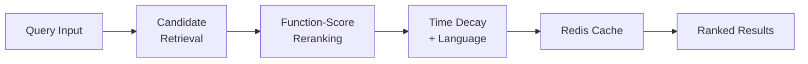

## Overview

At **Bucketplace (오늘의집)**, built a two-stage content ranking system for 3 content types with time decay and a global language analyzer, served via Redis caching.

## Key Achievements

- Built two-stage ranking pipeline (candidate retrieval + function-score reranking) for 3 content types
- Integrated time decay into ranking
- Implemented a global language analyzer for search quality
- Redis-cached serving for low-latency responses

## Technical Approach

### Stage 1 — Candidate Retrieval

ElasticSearch `multi_match` queries with a global language analyzer (Korean synonym analyzer) across multiple fields: title, card descriptions, hashtags, user nicknames/companies, style names, area names, and residence information.

- **Match Strategy**: `best_fields` with `tie_breaker=0.2` for initial matching
- **Recall Optimization**: `minimum_should_match: 30%` for OR-based search to maximize recall
- **Phrase Matching**: Variable `slop` parameters tuned per field — `slop=1` for hashtags, `slop=2` for titles, `slop=3` for longer descriptions

### Stage 2 — Function-Score Reranking

Reranking candidates using ElasticSearch `function_score` queries with `most_fields` to accumulate relevance scores across multiple field matches:

- **Matching Features**: Multi-match and phrase matching scores
- **Embedding Features**: Cross-modal similarity (dense vector matching)
- **Feedback Signals**: Click-through data from user interactions
- **Temporal Features**: Recency decay and engagement velocity
- **Quality Signals**: Content quality scoring and sorting mechanisms

### Content Type Unification

Unified 3 existing content collections (photos, home tours, know-how) under a consolidated "Content" tab with a common ranking pipeline.

### Serving Architecture

Data processing via Airflow batch jobs with results cached in Redis for low-latency direct client access, serving both app and web interfaces.

## Tech Stack

- **Search Engine**: ElasticSearch (multi_match, function_score, phrase matching)
- **Orchestration**: Airflow (batch processing)
- **Backend**: Go Server
- **Caching**: Redis
- **Ranking Signals**: BM25, cross-modal embeddings, click feedback, time decay

## Period

July 2023 - September 2023 | Bucketplace (오늘의집)
