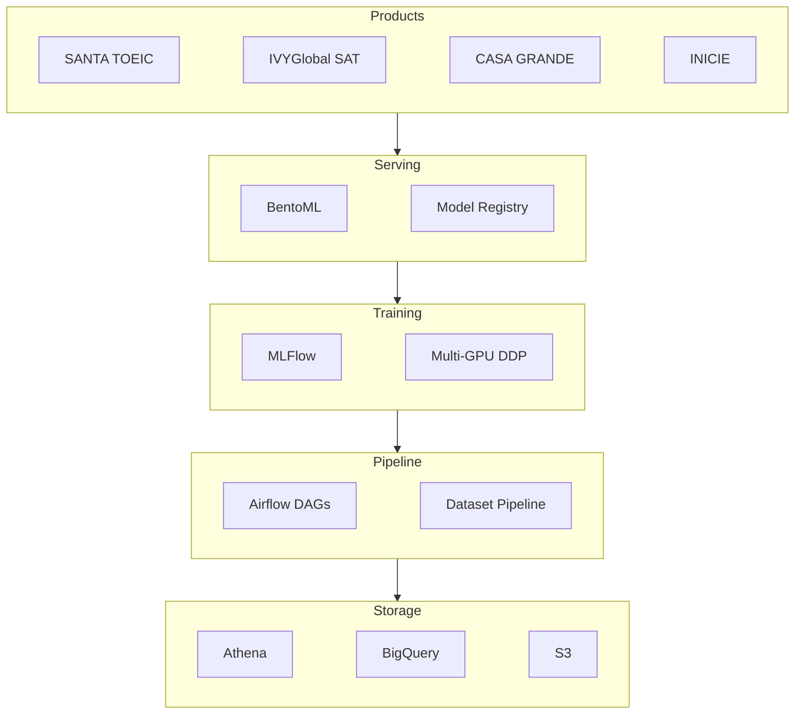

## Overview

At **RIIID (뤼이드)**, built a model registry using MLFlow and dataset pipelines using Airflow, Athena, and BigQuery, serving 4+ products.

## Key Achievements

- Built model registry with MLFlow
- Built dataset pipelines with Airflow, Athena, and BigQuery
- Infrastructure served 4+ products: SANTA TOEIC, IVYGlobal SAT, CASA GRANDE, and INICIE

## Technical Approach

- **Model Registry**: Built on MLFlow for model versioning and experiment tracking
- **Dataset Pipelines**: Orchestrated with Apache Airflow, using AWS Athena and GCP BigQuery for data processing
- **Containerization**: Pipeline components containerized with Docker

## Tech Stack

- **Model Management**: MLFlow
- **Orchestration**: Apache Airflow
- **Data Processing**: AWS Athena, GCP BigQuery
- **Containerization**: Docker
- **Products Served**: SANTA TOEIC, IVYGlobal SAT, CASA GRANDE, INICIE

## Period

January 2021 - September 2021 | RIIID (뤼이드)

## Talks

- **PyCon KR 2021**: "하나의 코드 베이스, 파이프라인으로 여러 도메인에 AI 모델들을 배포할 수 있을까" (Can We Deploy AI Models Across Multiple Domains with a Single Codebase and Pipeline?)
