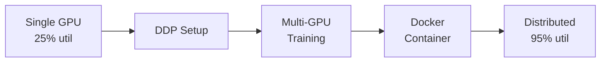

## Overview

At **RIIID (뤼이드)**, introduced the company's first multi-GPU training and improved all pipeline procedures.

## Key Achievements

- **GPU Utilization**: Increased from 25% to 95%
- **Initialization Time**: Reduced from 1 hour to 10 seconds
- **First Multi-GPU Training**: Introduced the first multi-GPU training in the company
- **CI/CD**: Built CI/CD pipelines using GitHub Actions

## Technical Approach

- Introduced multi-GPU training to the company for the first time
- Improved all pipeline procedures, resulting in GPU utilization going from 25% to 95% and initialization time dropping from 1 hour to 10 seconds
- Set up CI/CD with GitHub Actions

## Tech Stack

- **Training**: Multi-GPU, Data-Distributed Training (PyTorch DDP)
- **CI/CD**: GitHub Actions
- **Infrastructure**: Docker, AWS

## Period

June 2020 - December 2020 | RIIID (뤼이드)
