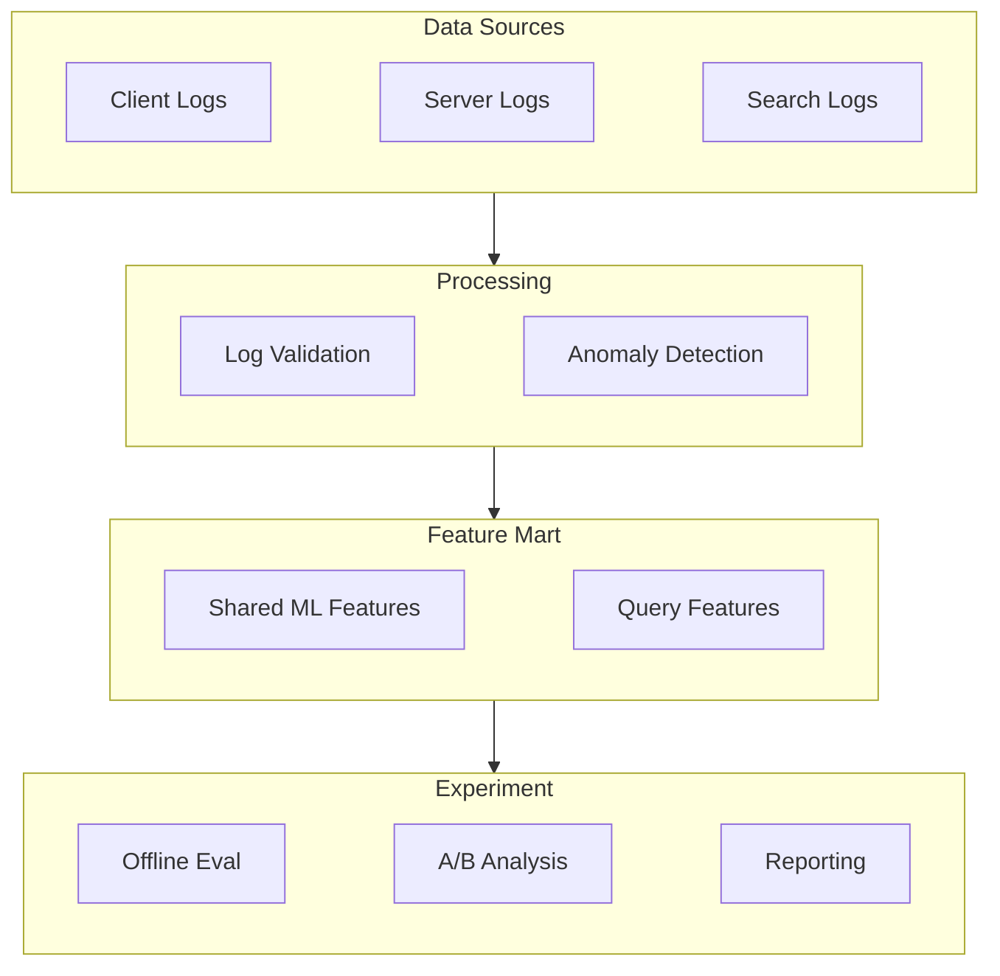

## Overview

At **Bucketplace (오늘의집)**, improved data quality monitoring by implementing client-side log validation and log anomaly detection notifications.

## Key Achievements

- Designed **shared ML feature mart** for the Search Team
- Implemented **client-side log validation** at the ingestion layer
- Built **lag anomaly detection** with automated notifications
- Created **automated A/B test analysis pipeline** for experiment reporting

## Technical Approach

### Search Mart v2 Pipeline

Designed and built the Search Team's shared ML feature mart (Search Mart v2), consolidating search logs, server logs, and client interaction logs into a unified feature pipeline for downstream ML models and experiment analysis.

### Client-Side Log Validation

Implemented `DataQualityOperator` for validation at the log ingestion layer, catching schema mismatches, missing fields, and malformed events before they enter the pipeline.

### Log Anomaly Detection

Built automated lag anomaly detection with notification alerts, enabling the team to detect and respond to data freshness issues and pipeline failures proactively.

### Automated A/B Test Analysis

Created a standardized experiment analysis pipeline producing automated reports for Search Team A/B tests — reducing manual analysis effort and ensuring consistent metric computation.

## Tech Stack

- **Data Processing**: PySpark, Athena
- **Data Warehouse**: HiveDB
- **Orchestration**: Airflow (DataQualityOperator)
- **Monitoring**: Anomaly detection, automated alerting

## Period

April 2023 - June 2023 | Bucketplace (오늘의집)
