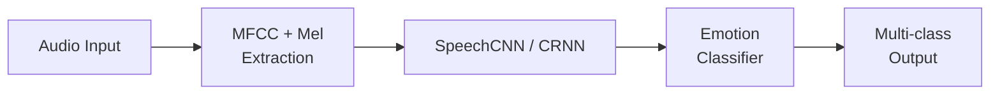

## Overview

At **Humelo (휴멜로)**, I managed and developed a speech emotion classification system for the Emotional TTS pipeline. The system performed feature extraction and multi-class emotion detection from audio signals.

## Key Achievements

- Built feature extraction and classifier for multi-class emotion detection from audio signals
- Integrated the emotion recognition module into the Emotional TTS pipeline

## Technical Approach

### Feature Extraction

Implemented feature extraction using MFCC and Mel-spectrogram analysis from audio signals.

### Classifier Architecture

Developed and evaluated two architectures:

- **SpeechCNN**: A convolutional neural network for audio-based emotion classification
- **CRNN**: A convolutional recurrent neural network combining CNN with recurrent layers

### Multi-Class Emotion Detection

The system classified audio segments into multiple emotion categories.

## Tech Stack

- **Deep Learning Framework**: TensorFlow
- **Architectures**: SpeechCNN, CRNN
- **Audio Features**: MFCC, Mel-spectrogram analysis
- **Domain**: Speech emotion recognition, multi-class classification

## Period

April 2018 - February 2019 | Humelo (휴멜로)
